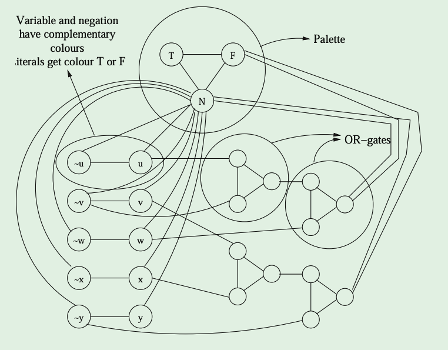
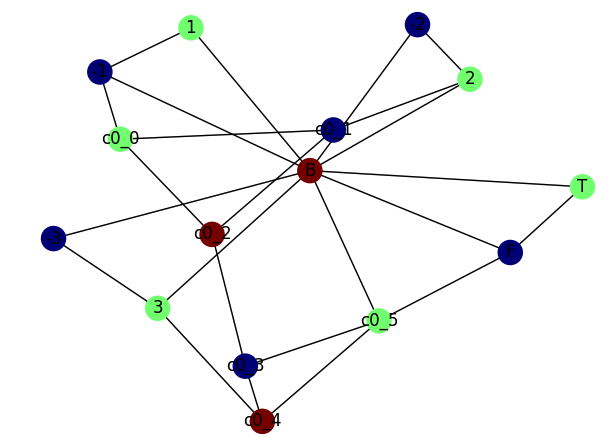
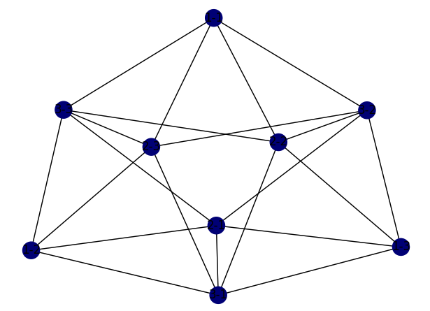

# NP-Complete Project: Graph Coloring
**Name:** Andrew Hankins
**Course:** CS 570
**Due:** May 7th, 2023

## Requirements

The programs in this repository have been tested and developed on `Python 3.10.6`.

In order to run the graph coloring programs, you will need to install the following Python packages:
* `networkx version 2.5.1`: This package us used for creating and manipulating graphs. It provides a simple and powerful interface for working with graphs in Python, including algorithms for graph traversal, shortest paths, and more.
* `matplotlib version 3.4.3`: This package is used for plotting graphs. It provides a wide range of plotting tools and customization options.

To install each of these packages, you can used the `pip` package manager. Use the following commands to install them:
```
pip install networkx==2.5.1
pip install matplotlib==3.4.2
```

## Repository Structure
```
CS570-Project3/
 ├── README.md : Overview of the repo and project.
 ├── heuristic.py : A heuristic algorithm for the graph coloring problem.
 ├── bruteforce.py : A brute force implementation of the graph coloring algorithm.
 ├── graph_util.py : Module containing utility functions for handling graphs.
 |
 ├── optimal/
 |     ├── simple.dat : A simple graph where bf/h get the same result.
 |     ├── intractable.dat : A complex graph that bf cannot compute.
 |
 ├── suboptimal/
 |    ├── suboptimal1.dat
 |    ├── suboptimal2.dat
 |    ├── suboptimal3.dat
 |    ├── suboptimal4.dat
 |
 ├── 3sat_to_graph_coloring/
 |    ├── 3sat_to_graph_coloring.py : Program that maps a 3sat problem to a gc problem
 |    ├── 3sat_to_gc1.dat
 |    ├── 3sat_to_gc2.dat
 |    ├── 3sat_to_gc3.dat
 |    ├── example_mapping.png
 |    ├── example_result.png
 |
 ├── graph_coloring_to_clique/
      ├── gc_to_clique.py : Program that will map a graph coloring problem to the clique problem.
      ├── gc_to_clique.dat
      ├── example_result.png
```

## Graph Coloring Algorithms

### Data File Format
Graphs will be passed to the two algorithms using a data file in the following format:
```
Graph Coloring Problem:
<num vertices>
<vertex> <vertex> <weight>
<vertex> <vertex> <weight>
...
<vertex> <vertex> <weigth>
$
```
**Example `graph.dat`:**
```
Graph Coloring Problem:
3
1 2 1
1 3 1
2 3 1
$
```
**Note:** The weights will have no effect, but must be included.

### Brute Force Algorithm

**Approach:**
For the brute force graph coloring algorithm, the program will incrementally test all possible graph colorings from 1 ... k. The program will exit as soon as the first solution is found, which is guaranteed to be the chromatic number, or least number of colors needed to color the graph.

**Running the brute force algorithm:**
In order to run the brute force algorithm for the graph coloring problem, use the following command:
```
python3 bruteforce.py <graph> <visual>
```
The `<graph>` arguments corresponds to a graph data file that follows the previously described format.
The `<visual>` argument requires a `y` or `n` option. If `y` is given, the `networkx` library will be used to create a visual representation of the graph coloring.

### Heuristic Algorithm

**Approach:**
The heuristic algorithm used for the graph coloring problem works by incrementally attempting to color the graph in decreasing order of the node's degree. This means that nodes with more edges connected to them will be colored first, as they are more likely to cause conflicts if left uncolored. If the current number of colors is not enough to color the graph without conflicts, the algorithm will increase the number of colors allowed. This continues until a valid coloring is found.

**Running the heuristic algorithm:**
```
python3 heuristic.py <graph> <visual>
```
The `<graph>` arguments corresponds to a graph data file that follows the previously described format.
The `<visual>` argument requires a `y` or `n` option. If `y` is given, the `networkx` library will be used to create a visual representation of the graph coloring.

### Examples

#### Simple:
For simple problems, the brute force and heuristic algorithm will both complete in roughly the same amount of time, and result in the same chromatic number for the graph.
**Input:**

**Brute Force Output:**
```
% python3 bruteforce.py ./optimal/simple.dat y
Chromatic number: 3
Coloring: {1: 1, 2: 2, 3: 3, 4: 1}
```
**Heuristic Output:**
```
% python3 heuristic.py ./optimal/simple.dat n
Chromatic number: 3
Coloring: {1: 3, 2: 1, 3: 2, 4: 3}
```
#### Intractable:
For intractable problems, the brute force is not viable due to how long it would take to find a solution. Instead, we just use the heuristic approach to try to guess a close to optimal solution.
**Input:**
```
Graph Coloring Problem:
20
1 2 0
2 3 0
3 4 0
4 5 0
5 6 0
6 7 0
7 8 0
8 9 0
9 10 0
10 11 0
11 12 0
12 13 0
13 14 0
14 15 0
15 16 0
16 17 0
17 18 0
18 19 0
19 20 0
2 4 0
6 8 0
10 12 0
14 16 0
18 20 0
$
```
**Heuristic Output:**
```
% python3 heuristic.py ./optimal/intractable.dat y
Chromatic number: 3
Coloring: {1: 2, 2: 1, 3: 3, 4: 2, 5: 3, 6: 1, 7: 3, 8: 2, 9: 3, 10: 1, 11: 3, 12: 2, 13: 3, 14: 1, 15: 3, 16: 2, 17: 3, 18: 1, 19: 2, 20: 3}
```

#### Interesting:
Since the heurstic approach attempts to guess at the optimal solution, it can sometimes provide suboptimal solutions for certain graphs. One of these graphs is the following:
**Input:**
```
8
1 2 1
2 3 1
3 4 1
4 5 1
5 6 1
6 1 1
1 7 1
4 8 1
$
```
**Brute Force Output:**
```
% python3 bruteforce.py ./suboptimal/gc_achankins.dat y
Chromatic number: 2
Coloring: {1: 1, 2: 2, 3: 1, 4: 2, 5: 1, 6: 2, 7: 2, 8: 1}
```
**Heuristic Output:**
```
% python3 heuristic.py ./suboptimal/gc_achankins.dat y
Chromatic number: 3
Coloring: {1: 1, 2: 2, 3: 3, 4: 1, 5: 2, 6: 3, 7: 2, 8: 2}
```

## Mappings

### Mapping to the Graph Coloring Problem from 3-SAT

#### Approach:
Since both the Graph Coloring Problem and 3-SAT problem are NP-Hard, they are able to be reduced to and from each other. For this project, I chose to map the 3-SAT problem to the graph coloring problem.

First let us assume that the 3-SAT problem has a 3-SAT formula of `m` clauses with `n` variables denoted `x_1, x_2, ..., x_n`. The graph that will implement the reduction can be constucted using the following:
1. For every variable `x_i` construct a vertex `v_i` in the graph and a vertex `v_i'` denoting the negation of the variable `x_i`. An edge should then be added between these two vertices.
3. Add three vertices denoted `'T'`, `'F'`, and `'B'`. These will denote the values True, False, and Base. Connect these vertices such that a triangle is formed.
4. Connect every `v_i` and `v_i'` with vertex `'B'`.
5. Create an OR gadget graph for each clause `(u V v V w)` using 6 vertices denoted `ci_0, ci_1, ..., ci_5`. The reulting subgraph will be the following:
    ```
    G[u] = [ci_0]
    G[v] = [ci_1]
    G[w] = [ci_4]
    G[ci_0] = [u, ci_1, ci_2]
    G[ci_1] = [v, ci_0, ci_2]
    G[ci_2] = [ci_0, ci_1, ci_3]
    G[ci_3] = [ci_2, ci_4, ci_5]
    G[ci_4] = [w, ci_3, ci_5]
    G[ci_5] = [ci_3, ci_4]
    ```

Once this graph has been created, we then can run the graph coloring algorithm on it. If the graph is 3 colorable, then we know that the 3-SAT problem has a solution.

**Example:**



https://cgi.csc.liv.ac.uk/~igor/COMP309/3CP.pdf

#### Running the Mapping:
For a simple example of the mapping, I will only use one clause.
**Input 3-SAT formula:**
```
3-Sat Problem:
-1 2 3
$
```
**Mapping Result:**
```
% python3 3sat_to_gc.py 3sat_to_gc3.dat bf y
Chromatic number: 3
Coloring: {'-1': 1, '-2': 1, '-3': 1, '1': 2, '2': 2, '3': 2, 'B': 3, 'F': 1, 'T': 2, 'c0_0': 2, 'c0_1': 1, 'c0_2': 3, 'c0_3': 1, 'c0_4': 3, 'c0_5': 2}
```


### Mapping Graph Coloring to the Clique Problem

#### Approach:
Since both the graph coloring problem and the clique problem are included in the NP-Hard problem set, there exits a reduction between the two. For this project, I mapped the graph coloring problem onto the clique problem.

Given an instance of the graph coloring problem with a graph `G = (V, E)` and `k` colors, we can contstruct a new graph G' as follows:
1. For each vertex `v` in `V`, create `k` copies of `v`, denoted `v1, v2, ..., vk`. These copies represent the possible colors of vertex `v`.
2. Connect vertices in `V'` that meet the following conditions:
    1. `{u, v}` is not an edge in G.
    2. If `{u, v}` is an edge in G, then `color(u) != color(v)`

After running the clique algorithm over the new graph, if a clique of size `|V|` exists, then we know that the graph is `k` colorable.

#### Running the mapping:

**Input Graph:**
```
Graph Coloring Problem:
3
1 3 1
1 2 1
$
```
**Mapping Result:**
```
% python3 gc_to_clique.py gc_to_clique.dat y 3
```

```
Clique Problem:
9
1 8 0
1 9 0
1 5 0
1 6 0
2 7 0
2 9 0
2 4 0
2 6 0
3 7 0
3 8 0
3 4 0
3 5 0
4 7 0
4 8 0
4 9 0
5 7 0
5 8 0
5 9 0
6 7 0
6 8 0
6 9 0
$
```



From here, we can then analyze the graph, and check whether a clique of size `|V|` exists, which in this case is 3. Looking at the graph, a clique of size 3 does exists, therefore we know that the graph is 3 colorable

## References
The following references were used when create the graph coloring algorithms and mappings:
```
1. https://www.researchgate.net/publication/305457929_Reducing_graph_coloring_to_clique_search
2. https://cgi.csc.liv.ac.uk/~igor/COMP309/3CP.pdf
3. https://www.geeksforgeeks.org/3-coloring-is-np-complete/
```
